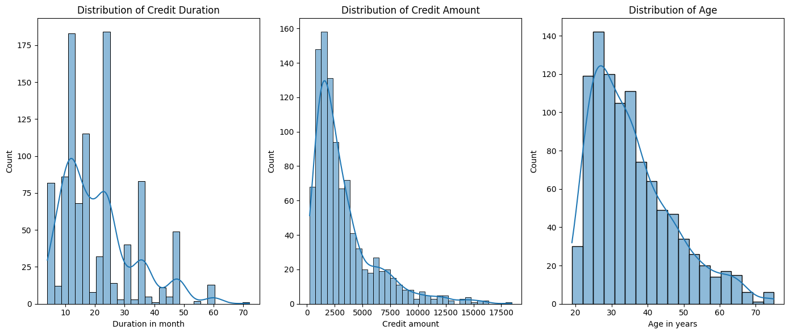
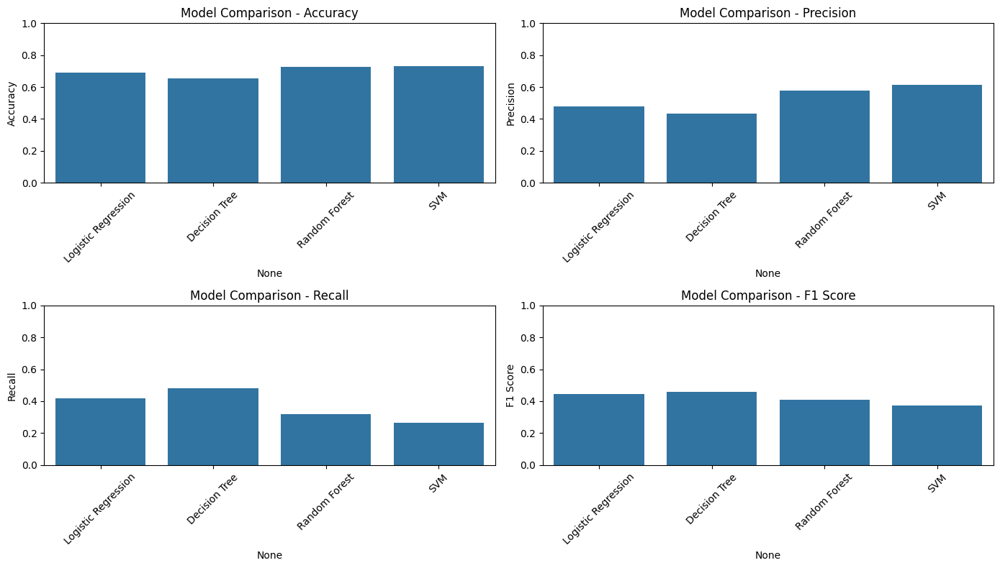
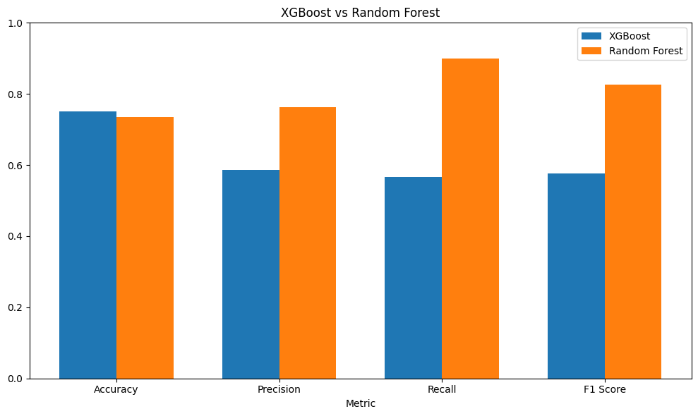
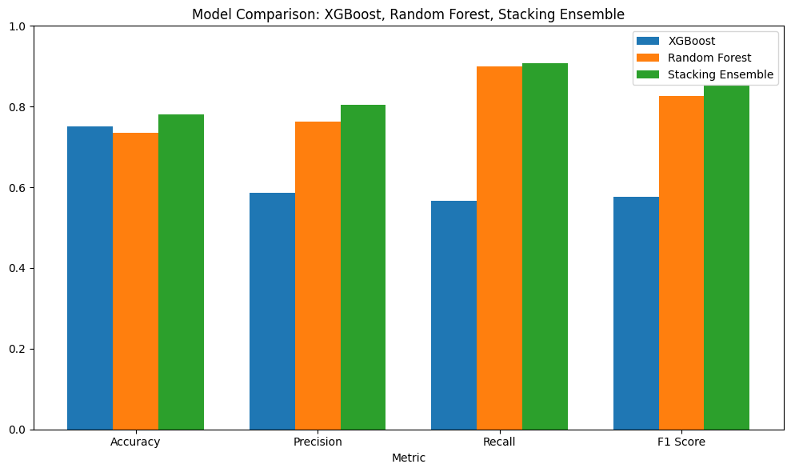

# Evaluating Machine Learning Models for Credit Risk Prediction

This project aims to build, evaluate, and compare machine learning models for classifying credit risk using XGBoost and Decision Tree algorithms. The objective is to predict whether a credit applicant is a "Good" or "Bad" credit risk based on historical data. The models were trained, validated, and tested on the given dataset.

## Objectives

- Credit Risk Assessment: Develop a model to accurately predict credit risk, classifying clients as "Good" or "Bad" based on their likelihood of defaulting on loans.

- Model Training and Evaluation: Train multiple machine learning models, including Logistic Regression, Decision Trees, Random Forest, SVM, and XGBoost, to determine the best-performing model.

- Model Comparison: Conduct a comparative analysis of various models using accuracy, precision, recall, and F1 score to identify the most effective model for credit risk prediction.
## Dataset

Dataset used in this project :

Hofmann,Hans. (1994). Statlog (German Credit Data). UCI Machine Learning Repository. https://doi.org/10.24432/C5NC77.

The dataset consists of credit applicants, with each row representing an applicant and each column representing a feature such as age, income, loan amount, and more. The target variable is binary:

- 1 representing "Good" credit risk.
- 2 representing "Bad" credit risk.
## Data Exploration

*Distribution of Credit Characteristics*

- ***Distribution of Credit Duration:*** A right-skewed distribution, indicating a majority of credits have shorter durations, with a tail towards longer durations.

- ***Distribution of Credit Amount:*** A right-skewed distribution as well, suggesting most credits are for smaller amounts with fewer larger loans.

- ***Distribution of Age:*** A relatively normal distribution, with a peak around the middle ages and tapering off towards younger and older age groups.

- ***Customer Segmentation:*** The distributions suggest potential customer segmentation based on credit duration, amount, and age. We can identify segments like 'short-term, small-amount borrowers' or 'long-term, high-amount, middle-aged borrowers.'

## Baseline Models

**Model Performance**

| Model               | Accuracy | Precision | Recall   | F1 Score |
|---------------------|----------|-----------|----------|----------|
| Logistic Regression | 0.690    | 0.480769  | 0.416667 | 0.446429 |
| Decision Tree       | 0.655    | 0.432836  | 0.483333 | 0.456693 |
| Random Forest       | 0.725    | 0.575758  | 0.316667 | 0.408602 |
| SVM                 | 0.730    | 0.615385  | 0.266667 | 0.372093 |

- ***Model Selection:***  Based on the provided metrics, Random Forest appears to be the most suitable model for this particular problem.

- ***Performance Bottlenecks:*** The lower performance of SVM, particularly in Recall, suggests potential issues with correctly identifying positive cases.

- ***Metric Importance:*** The varying performance across metrics emphasizes the need to carefully consider which metric is most critical for the specific application.

## Advanced Models

**Model Performance (validation set)**

| Model               | Accuracy | Precision | Recall   | F1 Score |
|---------------------|----------|-----------|----------|----------|
| LightGBM            | 0.725    | 0.549000  | 0.466700 | 0.504500 |
| XGBoost             | 0.725    | 0.547200  | 0.483300 | 0.513300 |
| Hyperparameter Tuning (XGBoost)             | 0.7100    |0.5200  | 0.4333 | 0.4727 |

## Best Models Comparison

- Random Forest significantly outperforms XGBoost in terms of Precision, Recall, and F1-Score. This indicates that Random Forest is better at correctly identifying positive cases and has a better balance between precision and recall.

- XGBoost has a slightly higher Accuracy. However, given the superior performance of Random Forest in the other metrics, accuracy alone might not be the best indicator of overall performance in this case.
## Stacking Ensemble

Stacking ensembles aim to leverage the strengths of multiple models by combining them in a way that produces a more robust and accurate predictive model.

| Model               | Accuracy | Precision | Recall   | F1 Score |
|---------------------|----------|-----------|----------|----------|
| Random Forest       | 0.725    | 0.575758  | 0.316667 | 0.408602 |
| XGBoost             | 0.725    | 0.547200  | 0.483300 | 0.513300 |
| Stacking            | 0.780    | 0.803800  | 0.907100 | 0.852300 |

The Stacking Ensemble consistently outperforms both XGBoost and Random Forest across all metrics, indicating its superior performance.
## Conclusion

The stacking ensemble model emerged as the best performer in this project, achieving the highest accuracy and F1 score on the test set. By combining XGBoost and Random Forest through a Logistic Regression meta-model, we were able to build a more reliable and effective predictive model for credit risk classification.

This project highlights the importance of exploring multiple models and techniques, including ensemble methods, to achieve optimal results in machine learning tasks. The stacking ensemble provided a significant performance boost over individual models, making it a strong candidate for deployment in real-world credit risk prediction scenarios.
